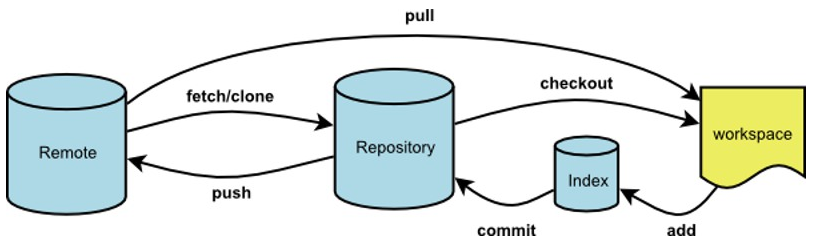

## 核心流程图



## 文件四种状态

- Untracked
- Staged / Index
- Unmodified / Head
- Modified

新增文件，处于Untracked；

git add后，处于Staged；

git commit后，处于Unmodified；

修改Unmodified的文件，那么就处于Modified状态；


## 撤销操作

git reset HEAD  -- <filename>  拉取最近一次提交版本库的文件到暂存区，该操作不影响工作区

git checkout -- <filename> 拉取暂存区文件，并将其替换成工作区文件

git commit --amend 撤销上次提交，并将暂存区文件重新提交


## 合并操作

git rebase -i <commitId> 

pick 执行这次commit

squash 这个commit会被合并到前一个commit


## 常用命令

```
git add
git commit
git push
git status
git branch
git rebase
git merge
git stash
git pull
git fetch
git log
git reflog
git remote
git clone
gti reset
```


### git reset模式

git reset <commitID> --hard  回到当时指定commit的状态

- --hard：不保存所有变更
- --soft：保留变更且变更内容处于暂存区（Staged）
- --mixed：保留变更且变更内容处于工作区


### git branch

```
git branch //查看本地所有分支 
git branch -r //查看远程所有分支
git branch -a //查看本地和远程的所有分支
git branch <branchname> //新建分支
git branch -d <branchname> //删除本地分支
git branch -d -r <branchname> //删除远程分支，删除后还需推送到服务器
git push origin:<branchname>  //删除后推送至服务器
git branch -m <oldbranch> <newbranch> //重命名本地分支

//git中一些选项解释:
-d  --delete：删除
-D  --delete --force的快捷键
-f  --force：强制
-m  --move：移动或重命名
-M  --move --force的快捷键
-r  --remote：远程
-a  --all：所有
```

细节：

1. 如果在分支A中进行了写操作，但此操作局限在工作区中进行（没add  commit），切换到master后看到该操作；可以成功删除分支A
2. 如果在分支A中进行了写操作，但进行add  commit，切换到master后无法观察到该操作；
3. 有add ，没commit时候切换分支，能不能成功看两个分支是否统一commit状态


fast forward：

1. 两个分支fast forward归于一点commit
2. 没有分支信息

git在merge时候，默认使用fast forward，也可以禁止； git merge --no--ff

1. 两个分支fast forward没有归于一点commit，主动合并之后会前进一步
2. 分支信息完整


### git checkout


`git checkout -b <name> <template> `  创建并切换分支

`git checkout -b <name>  origin <template> `  从远程仓库拉取分支

name:分支名字

template：以哪个分支或者commit为模板，如果不填则以当前所在分支为模板


git push --set-upstream origin bc-a  将远程仓库分支作为上流分支


checkout：

- 放弃修改，放弃工作区中的修改，相当于暂存区或者对象区
- 版本穿梭
  - 修改后、必须提交
  - 创建分支的好时机


### git pull 

git  pull = git fetch + git merge

git merge <branchName> 合并分支的**变更**

### git rebase

枚举变更的commit依次变基，指重新排列base，而base就是commit


当前分支： git rebase master

解决冲突后：git rebase --continue

### git  stash

使用场景：index.html 已经commit了，当前index.html又做了一些修改并且不想提交，但是原来的commit版本上要修复bug，就可先用git stash把工作区的修改暂存起来

git stash 保存现场

git stash list 显示暂存列表

git stash apply 恢复暂存，但是保留暂存列表信息

git stash pop恢复暂存，但删除暂存列表信息

git stash drop xxx  删除现场


栈的形式，默认还原最近一次


### git rm

git rm xxx  删除文件并放到暂存区

操作系统删除，就放到工作区


git rm 后悔：

​	git reset HEAD hello.txt

​	git checkout  -- hello.txt


git rm --cached hello.txt


### git log

git log graph

git log -4

git log pretty=online

git log pretty=format:"%h - %an , %ar : %s"

git log --graph --pretty=oneline --abbrev-commit


### git config  

`git config --global` :  基本不用，给整个计算机一次性设置

`git config --system`:  推荐、给当前用户一次性设置 ~/.gitconfig

`git config --local`: 给当前项目一次性设置  .git/config

如果同时设置，当前项目优先级高


git config --local --unset user.name


## 忽略文件

.gitignore


## 版本穿梭

```
git commit -am "xxx"
git commit -amend -m "xxx" 修改commit注释

git reset --hard HEAD^  回退到上一次commit
git reset --hard HEAD^^ 回退到上2次commit
git reset --hard HEAD~n 回退到上n次commit
git reset --hard <sha1> 回退到指定commit

git reflog 查看所有记录
```


git tag 

git blame: 追责

git diff :  比较暂存区和工作区的差异

git diff <commitid> : 比较对象区和工作区差异

git diff HEAD：比较最近对象区和工作区差异

git diff --cached <commitid> 比较对象区和暂存区差异

