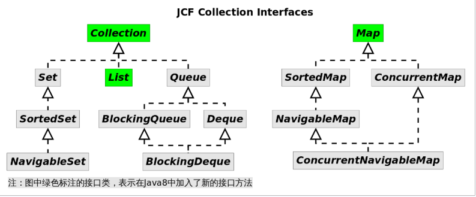
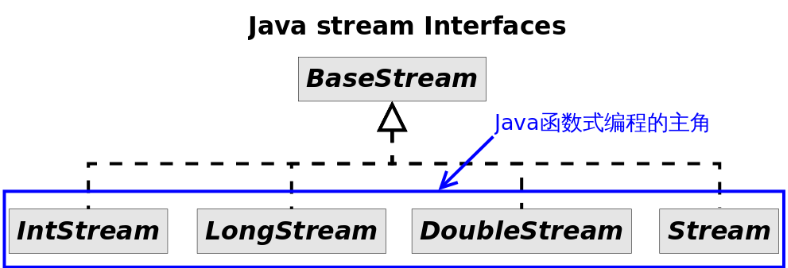
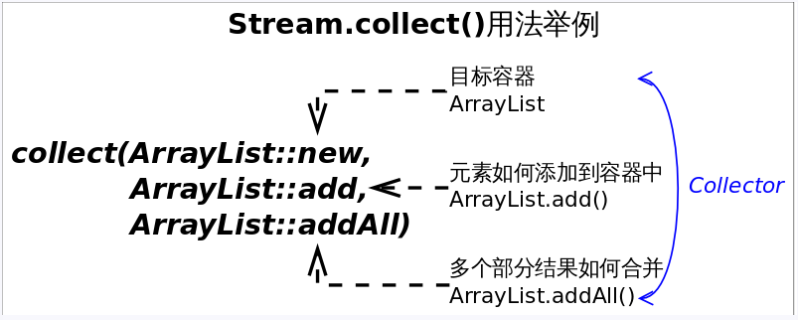
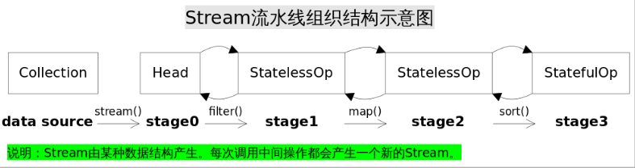

# Lambda

能够使用Lambda的依据是必须有相应的函数接口；

lambda不是匿名内部类的缩写，与匿名内部类不同，lambda表达式被封装成了主类的一个私有方法，并通过*invokedynamic*指令进行调用，因此Lambda内部的`this`引用也就跟内部类对象没什么关系了；

回顾Java集合框架的接口继承结构：



| 接口名          | Java8新加入的方法                                            |
| :-------------- | :----------------------------------------------------------- |
| Collection（5） | removeIf() spliterator() stream() parallelStream() forEach() |
| List（2）       | replaceAll() sort()                                          |
| Map（10）       | getOrDefault()  forEach()  replaceAll()  putIfAbsent()  remove()  replace()  computeIfAbsent() computeIfPresent()  compute()  merge() |

## 函数接口

| 接口              | 入参  | 出参    | 说明                         |
| ----------------- | ----- | ------- | ---------------------------- |
| Predicate<T>      | T     | boolean | 断言                         |
| Consumer<T>       | T     | /       | 消费一个数据                 |
| Function<R>       | T     | R       | 输入T输出R函数               |
| Supplier<T>       | /     | T       | 提供一个数据                 |
| UnaryOperator<T>  | T     | T       | 一元函数（输入输出类型相同） |
| BiFunction<T,U,R> | (T,U) | R       | 2个输入函数                  |
| BinaryOperator<T> | (T,T) | T       | 二元函数                     |

## 方法引用、构造器引用、数组引用

| 方法引用类别       | 举例             |
| :----------------- | :--------------- |
| 引用静态方法       | `Integer::sum`   |
| 引用某个对象的方法 | `list::add`      |
| 引用某个类的方法   | `String::length` |
| 引用构造方法       | `HashMap::new`   |

### 方法引用：

若 Lambda 体中的功能，已经有方法提供了实现，可以使用方法引用（可以将方法引用理解为 Lambda 表达式的另外一种表现形式）

- 对象的引用 :: 实例方法名

- 类名 :: 静态方法名

- 类名 :: 实例方法名
  注意：
   ①方法引用所引用的方法的参数列表与返回值类型，需要与函数式接口中抽象方法的参数列表和返回值类型保持一致！
   ②若Lambda 的参数列表的第一个参数，是实例方法的调用者，第二个参数(或无参)是实例方法的参数时，格式： ClassName::MethodName


### 构造器引用 :

- 构造器的参数列表，需要与函数式接口中参数列表保持一致！

- 类名 :: new

### 数组引用

  类型[] :: new;


## 类型推断 

Lambda 表达式中的参数类型都是由编译器推断 得出的。Lambda 表达式中无需指定类型，程序依然可 以编译，这是因为 javac 根据程序的上下文，在后台 推断出了参数的类型。Lambda 表达式的类型依赖于上 下文环境，是由编译器推断出来的。

```java
Comparator<Integer> com = (Integer x,Integer y) -> {  //Integer 类型可以省略
  System.out.println("函数式接口");
  return Integer.compare(x, y);
};

BinaryOperator<Long> add = (Long x, Long y) -> x + y;// 4

BinaryOperator<Long> addImplicit = (x, y) -> x + y;// 5 类型推断
```

## 变量引用

内部类里面引用外部的变量的时候，必须是final。因为传的都是值到方法参数当中。

```java
public class Test {
    public static void main(String[] args) {
        User user = new User(18);
        changeUser(user);
        System.out.println(user);
    }

    private static void changeUser(User user) {
        user.setAge(19); // 能修改user的age
    }
    private static void changeUserToNull(User user) {
        user = null; // 不能修改
    }
}
```

## 级联表达式和柯里化

就是嵌套多层Function

```java
Function<Integer, Function<Integer, Function<Integer, Integer>>> currying =  x -> y -> z -> (x+y)*z;

System.out.println(currying.apply(4).apply(5).apply(6)); //54
```


# Stream

*stream*并不是某种数据结构，它只是数据源的一种视图。这里的数据源可以是一个数组，Java容器或I/O channel等。正因如此要得到一个*stream*通常不会手动创建，而是调用对应的工具方法，比如：

- 调用`Collection.stream()`或者`Collection.parallelStream()`方法
- 调用`Arrays.stream(T[] array)`方法

常见的*stream*接口继承关系如图：




*stream*和*collections*有以下不同：

- **无存储**。*stream*不是一种数据结构，它只是某种数据源的一个视图，数据源可以是一个数组，Java容器或I/O channel等。
- **为函数式编程而生**。对*stream*的任何修改都不会修改背后的数据源，比如对*stream*执行过滤操作并不会删除被过滤的元素，而是会产生一个不包含被过滤元素的新*stream*。
- **惰式执行**。*stream*上的操作并不会立即执行，只有等到用户真正需要结果的时候才会执行。
- **可消费性**。*stream*只能被“消费”一次，一旦遍历过就会失效，就像容器的迭代器那样，想要再次遍历必须重新生成。


*stream*的操作分为为两类，**中间操作(intermediate operations)和结束操作(terminal operations)**

1. **中间操作总是会惰式执行**，调用中间操作只会生成一个标记了该操作的新*stream*，仅此而已。

2. **结束操作会触发实际计算**，计算发生时会把所有中间操作积攒的操作以*pipeline*的方式执行，这样可以减少迭代次数。计算完成之后*stream*就会失效。

   

## 创建

|            | 相关方法                               |
| ---------- | -------------------------------------- |
| 集合       | Collection.stream/parallelStream       |
| 数组       | Arrays.stream                          |
| 数字Stream | IntStream/LongStream.range/rangeClosed |
|            | Random.ints/longs/doubles              |
| 自己创建   | Stream.generate/iterate                |

## 中间操作

|            | 相关方法             |
| ---------- | -------------------- |
| 无状态操作 | map/mapToXxx         |
|            | flagMap/flagMapToXxx |
|            | filter               |
|            | peek                 |
|            | unordered            |
| 有状态操作 | distinct             |
|            | sorted               |
|            | limit/skip           |

## 终止操作

|            | 相关方法                    |
| ---------- | --------------------------- |
| 非短路操作 | forEach/forEachOrdered      |
|            | collect/toArray             |
|            | reduce                      |
|            | min/max/count               |
| 短路操作   | findFirst/findAny           |
|            | allMatch/anyMatch/noneMatch |

## 并行流

- 多次调用 parallel / sequential, 以最后一次调用为准.

```java
// 多次调用 parallel / sequential, 以最后一次调用为准.
IntStream.range(1, 100)
// 调用parallel产生并行流
.parallel().peek(StreamDemo5::debug)
// 调用sequential 产生串行流
.sequential().peek(StreamDemo5::debug2)
.count();
```

- 并行流使用的线程池修改和自定义

```java
// 并行流使用的线程池: ForkJoinPool.commonPool
// 默认的线程数是 当前机器的cpu个数
// 使用这个属性可以修改默认的线程数
System.setProperty("java.util.concurrent.ForkJoinPool.common.parallelism",
"20");
IntStream.range(1, 100).parallel().peek(StreamDemo5::debug).count();

// 使用自己的线程池, 不使用默认线程池, 防止任务被阻塞
// 线程名字 : ForkJoinPool-1
ForkJoinPool pool = new ForkJoinPool(20);
pool.submit(() -> IntStream.range(1, 100).parallel()
    .peek(StreamDemo5::debug).count());
pool.shutdown();
```


## 收集器



收集器（*Collector*）是为`Stream.collect()`方法量身打造的工具接口（类）。考虑一下将一个*Stream*转换成一个容器（或者*Map*）需要做哪些工作？我们至少需要两样东西：

1. 目标容器是什么？是*ArrayList*还是*HashSet*，或者是个*TreeMap*。
2. 新元素如何添加到容器中？是`List.add()`还是`Map.put()`。

如果并行的进行规约，还需要告诉*collect()* 3. 多个部分结果如何合并成一个。

```java
//　将Stream规约成List
Stream<String> stream = Stream.of("I", "love", "you", "too");
List<String> list = stream.collect(ArrayList::new, ArrayList::add, ArrayList::addAll);// 方式１
//List<String> list = stream.collect(Collectors.toList());// 方式2
System.out.println(list);
```

`reduce()`擅长的是生成一个值

`collect()`擅长生成一个集合或者*Map*等复杂的对象


### 使用collect()生成Collection

```java
// 将Stream转换成List或Set
Stream<String> stream = Stream.of("I", "love", "you", "too");
List<String> list = stream.collect(Collectors.toList()); // (1)
Set<String> set = stream.collect(Collectors.toSet()); // (2)
```

### 使用collect()生成Map

1. 使用`Collectors.toMap()`生成的收集器，用户需要指定如何生成*Map*的*key*和*value*。
2. 使用`Collectors.partitioningBy()`生成的收集器，对元素进行二分区操作时用到。
3. 使用`Collectors.groupingBy()`生成的收集器，对元素做*group*操作时用到。

### 使用collect()做字符串join

```java
// 使用Collectors.joining()拼接字符串
Stream<String> stream = Stream.of("I", "love", "you");
//String joined = stream.collect(Collectors.joining());// "Iloveyou"
//String joined = stream.collect(Collectors.joining(","));// "I,love,you"
String joined = stream.collect(Collectors.joining(",", "{", "}"));// "{I,love,you}"
```

### collect()自定义

除了可以使用*Collectors*工具类已经封装好的收集器，我们还可以自定义收集器，或者直接调用`collect(Supplier<R> supplier, BiConsumer<R,? super T> accumulator, BiConsumer<R,R> combiner)`方法，**收集任何形式你想要的信息**。不过*Collectors*工具类应该能满足我们的绝大部分需求，手动实现之间请先看看文档。


## 运行机制





# Optional

Optional<T>类（java.util.Optional）是一个容器类，代表一个值存在或者不存在，原来用null表示一个值不存在，现在Optional可以更好表达这个概念，并且可以避免空指针异常。

常用方法：

- Optional.of(T t)：创建一个Optional实例
- Optional.empty()：创建一个空的Optional实例
- Optional.ofNullable(T t)：若t不为null，创建Optional实例，否则创建空实例
- isPresent()：判断是否包含值
- orElse(T t)：如果调用对象包含值，返回该值，否则返回t
- orElseGet(Supplier s)：如果调用对象包含值，返回该值，否则返回s获取的值
- map(Function f)：如果油脂对其处理，并且返回处理后的Optional，否则返回Optional.empty()
- flatMap(Fucntion mapper)：与map类似，要求返回值必须是Optional


# Reference

[学习指南](https://mp.weixin.qq.com/s/0FzUeTvf9jH3pBEH9yEc0g#)

[后端进阶-Lambda](https://objcoding.com/2019/03/04/lambda/#lambda-and-anonymous-classesi)