# 基础

## 核心原理

**什么是RPC**

Remote Procedure Call，远程过程调用，主要作用有

- 屏蔽远程过程调用与本地调用的区别，让我们感觉就是调用项目内的方法；
- 隐藏底层网络通信的复杂性，让我们更专注业务逻辑。

**通信流程原理**

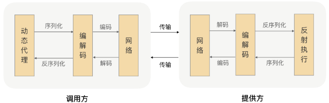

**应用架构图**

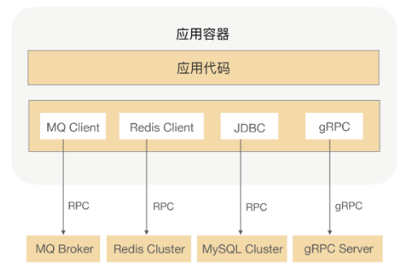

**思考问题**

- 调用过程超时了怎么处理业务？
- 什么场景下适合使用RPC？
- 什么时候需要考虑压缩？

## 协议

设计可扩展且向后兼容的协议

**协议的作用**

​	数据传输只能通过二进制形式在网络中拆包传输，需要通过协议”断句“，分割出正确的数据。

**有了HTTP协议，为什么还设计RPC私有协议**

- RPC更多负责应用间调用，需要性能更高；
- HTTP协议属于无状态协议，客户端无法对请求和响应进行关联

**可扩展的RPC协议**

通过设计扩展字段，向后兼容

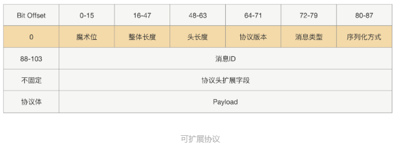

## 序列化

调用方请求的输入参数都是对象，需要通过序列化反序列化技术将对象与二进制做转换。

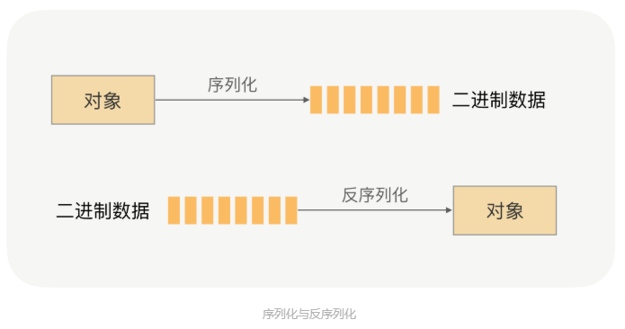

**常用的序列化技术**

- **JDK原生序列化**：存在安全漏洞
- **JSON**：传输的数据要相对较小，否则影响性能
- **Hessian**：使用上更加方便，在对象兼容性上更好
- **Protobuf**：更高效，更通用

**序列化技术选型**

优先考虑：安全性、通用型、兼容性

其次考虑：性能、效率、空间开销

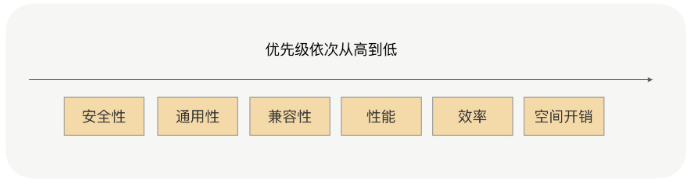

**使用RPC框架注意事项**

1. 出入参体积尽量不要太大
2. 尽量使用常用的、原生的对象，尤其是集合类
3. 对象要尽量简单，没有太多依赖关系，没有复杂的继承关系

## 网络通信

一次RPC调用，本质就是服务消费者与服务提供者之间的一次网络信息交换的过程。

所谓两台PC机之间的网络通信，实际上是两台PC机对网络IO的操作。

### **常见网络IO模型**

- 同步阻塞IO
- 同步非阻塞IO
- IO多路复用
- 异步非阻塞IO

其中同步阻塞IO和IO多路复用比较常用。

IO多路复用是指多个网络连接的IO可以注册到一个复用器（select）上，当用户进程调用了select，那么整个进程会被阻塞。同时，内核会“监视”所有select负责的socket，当任何一个socket中的数据准备好了，select就会返回。这个时候用户进程再调用read操作，将数据从内核中拷贝到用户进程。

### **网络IO模型的选型**

需要系统内核的支持和编程语言的支持。

RPC框架在网络通信上更倾向于IO多路复用。

### 零拷贝（Zero-copy）

**传统网络IO读写流程**

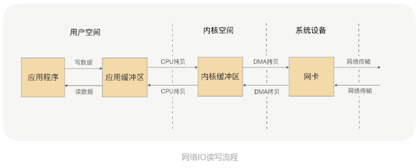

这里可以看到，每一次应用程序的完整读写操作，都需要在用户空间和内核空间中来回拷贝，并且每一次拷贝，都需要CPU进行一次（系统内核与用户进程间）的上下文切换，浪费了CPU和性能。

**零拷贝**（操作系统）

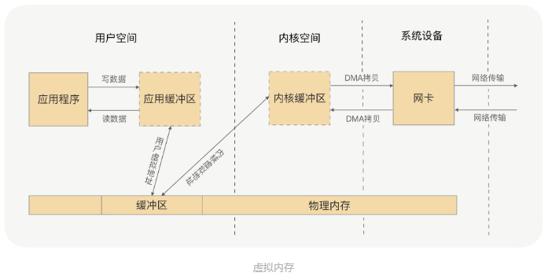

虚拟内存的存在，避免了用户空间和内核空间的拷贝切换。

零拷贝两种方式，mmap+write方式和sendfile方式。

Netty框架中的零拷贝是在用户空间的拷贝（拆包粘包），Netty中有很多ChannelHandler实现类，都是通过CompositeByteBuf、slice、warp操作来处理TCP传输中的拆包和粘包问题的。

## 动态代理

主要作用是面向接口编程，屏蔽RPC处理流程

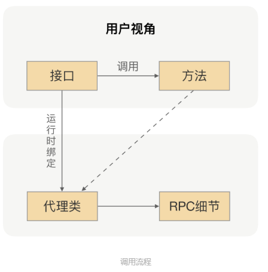

**常见代理方式**

- JDK默认代理:被代理类只能是接口，JDK8对反射调用有了很大提升
- Javassist：生成字节码，不需要反射调用，但是会冻结CtClass对象
- Byte Buddy：后起之秀，Spring、Jackson都用到，可读性更高、执行速度更快

## PRC实战

剖析RPC源码，动手实现RPC

源码地址：https://github.com/grpc/grpc-java

# 进阶

## 架构设计

### **RPC架构**

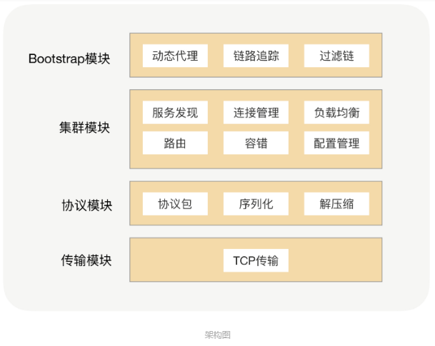

协议模块

- 传输模块：为了屏蔽网络传输的复杂性而封装的单独的数据传输模块
- 协议封装：序列化和反序列化、“断句“

数据压缩

### **可扩展架构**

包括核心功能体系和插件体系，可扩展性好，实现开闭原则，用户可以非常方便的通过插件扩展来实现自己的功能，不需要修改核心功能本身；其次保持了核心包的精简，依赖外部包少，有效减少版本冲突问题。

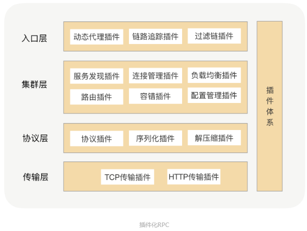

## **服务发现**

**为什么需要服务发现**

为了高何用，在生成环境中服务提供方都是以集群的方式对外提供服务，集群里面的这些IP可能随时变化，需要一本“通讯录”及时获取到对应服务节点，这个获取过程就是**服务发现**。

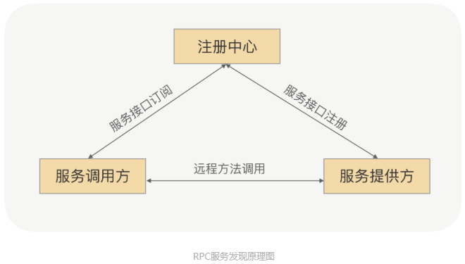

1. **服务注册**：在服务提供方启动的时候，将对外暴露的接口注册到注册中心，注册中心将这个服务节点的IP和接口保存下来。
2. **服务订阅**：在服务调用方启动的时候，去注册中心查找并订阅服务提供方的IP，然后缓存到本地，并用于后续的远程调用。

**为什么不使用DNS**

DNS流程图

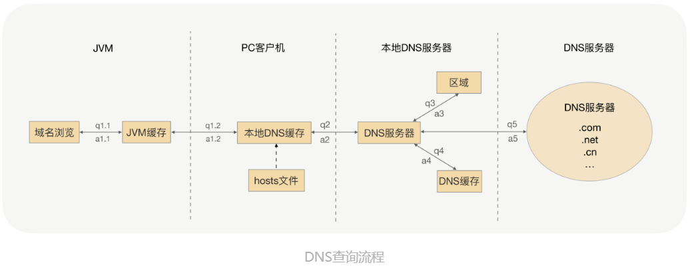

为了提升性能和减少DNS服务压力，DNS采取了多级缓存机制，一般配置的缓存时间比较长，特别是JVM默认缓存是永久有效的，所以说服务调用者不能及时感知服务节点的变化。

一种方案是加负载均衡设备。将域名绑定到这台负载均衡的设备上，通过DNS拿到负载均衡的IP。这样服务调用的时候，调用方直接跟VIP建立连接，由VIP机器完成TCP转发。

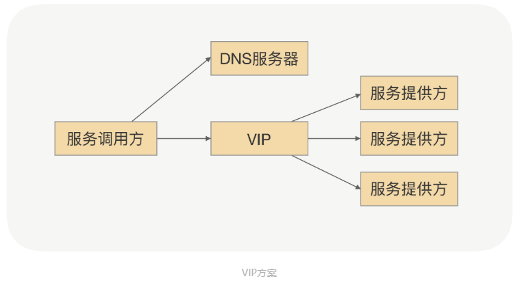

但是这种方案也有问题：

- 搭建负载均衡设备或者TCP/IP四层代理，需要额外成本；
- 请求流量都经过网络传输，多经过一次网络传输，会额外浪费些性能；
- 负载均衡节点或者摘除节点，一般需要手动添加，当大批量扩容或者下线时，会有大量的人工操作和生效延迟

**基于Zookeeper的服务发现**

搭建一个Zookeeper集群作为注册中心集群，服务注册的时候只需要服务节点向Zookeeper节点写入注册信息极客，利用Zookeeper的Watcher机制完成服务的订阅和服务下发功能。

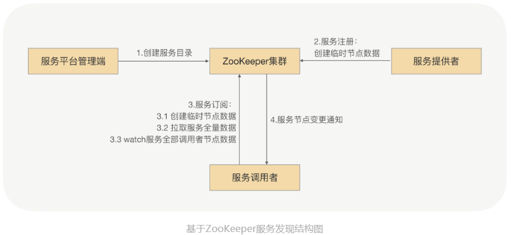

但是Zookeeper本身性能问题，当连接到Zookeeper的节点数量特别多，对Zookeeper读写特别频繁，且Zookeeper存储的目录达到一定数量的时候，Zookeeper将不再稳定，CPU持续升高，最终宕机。宕机之后，由于各业务的节点还在持续发送读写请求，刚一启动，Zookeeper就因无法承受瞬间的读写压力，马上宕机。

**基于消息总线的最终一致性的注册中心**

消息总线机制牺牲掉Zookeeper的CP，选择AP，换取整个注册中心集群的性能和稳定性。

为了性能，采用两级缓存，注册中心和消费者的内存缓存，通过异步推拉模式来确保最终一致性。

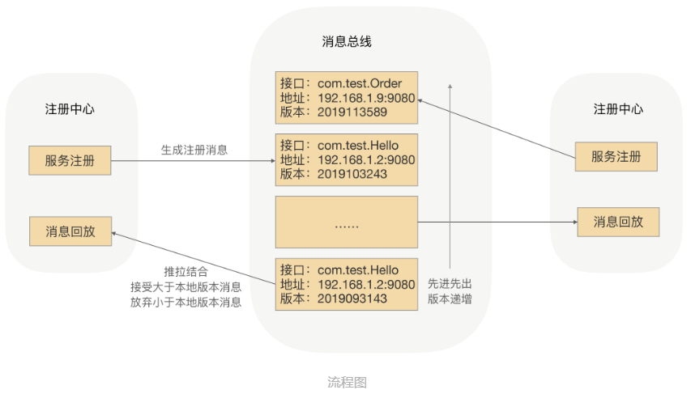

## 健康检查

**健康监测**能够帮助我们从连接列表里面过滤掉一些存在问题的节点，避免在发请求的时候选择出有问题的节点而影响业务。但是在设计健康监测方案的时候，我们不能简单从TCP连接是否健康、心跳是否正常等简单维度考虑，因为健康监测的目的是保证”业务无损“，所以可以加入业务请求可用率因素，最大化地提升RPC接口可用率。

## 路由策略

上线涉及到变更，为了减少风险会采用灰度发布，同时会采用路由策略让某些指定的应用才能调用新上线的应用做测试。

在注册中心做路由策略的话，复杂的计算逻辑会让注册中心压力很大，因此一般会把这个路由规则下发到服务调用方，如下图：

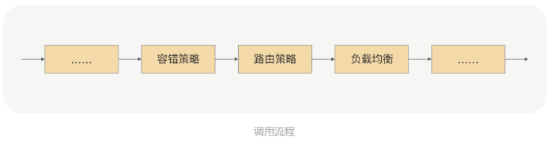

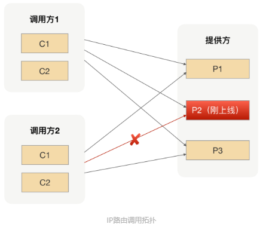

**参数路由**：更细粒度的路由方式，比如商品ID，每次关于该商品的请求都可以降落到新应用或者老应用上。如下图：

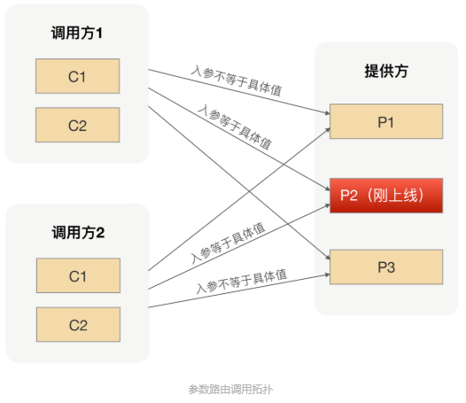

## 负载均衡

负载均衡主要分为软负载和硬负载，软负载就是在一台或多台服务器上安装负载均衡软件，如LVS、Nginx等，硬负载就是通过硬件设备来实现负载均衡，如F5服务器等。负载均衡算法包括随机法、轮询法、最小连接法等。

RPC框架的负载均衡与Web的负载均衡不同之处在于：RPC框架不依赖一个负载均衡或者负载均衡服务器来实现负载均衡的，而是由RPC框架本身实现的，服务调用者自主选择服务节点，发起服务调用。

这样好处在于，RPC框架不在需要依赖专门的负载均衡设备，可以节约成本；减少了与负载均衡设备间的额外网络传输，提升了传输效率；并且负载均衡策略可配，便于服务治理。

**RPC自适应负载均衡**

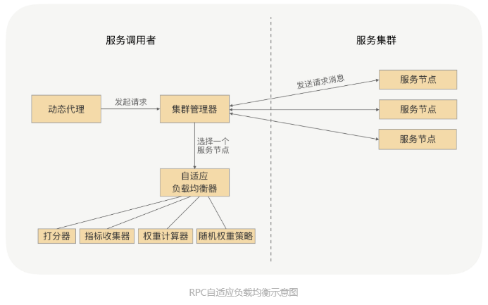

## 异常重试

当我们发起一次RPC调用，希望它尽可能成功的时候，就需要异常重试，比如通过用户名密码验证，获取用户基本信息。

异常重试需要考虑的问题：

1. 业务逻辑必须幂等；
2. 超时时间可以重置；
3. 去掉有问题的节点；
4. 添加异常白名单，对异常判定，决定是否重试。

**RPC异常重试**

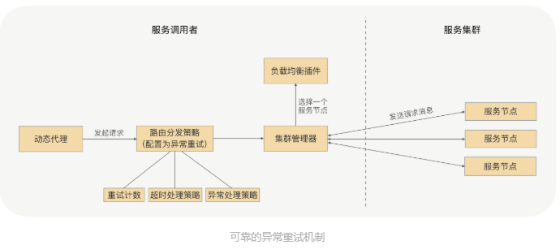

## 优雅关闭

服务下线存在问题：服务提供方正在关闭，还没有从健康列表中移除，导致调用失败。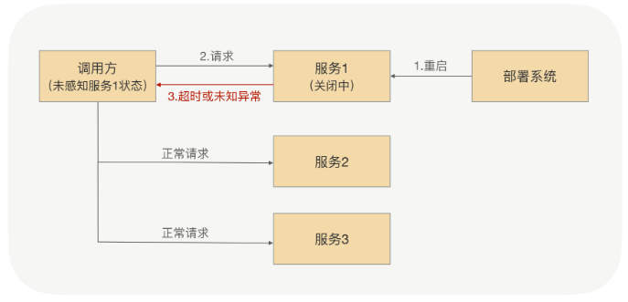

处理策略：

1. 人肉方式通知调用方去删除健康列表的节点，但是运维成本太高；
2. 注册中心方式，但是服务发现保证最终一致性，不能保证实时性；
3. 服务提供方内存维护一份调用方连接集合，主动调用方，在关闭前设置“挡板”。

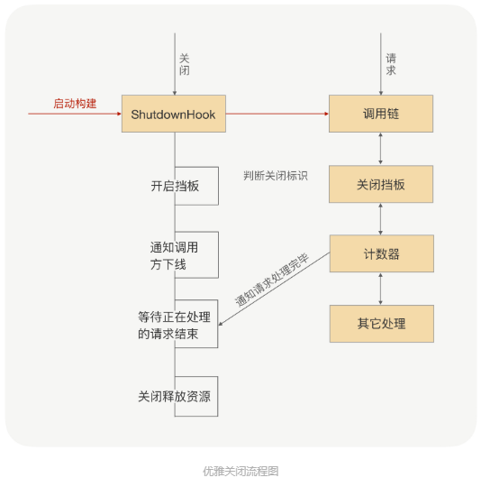

## 优雅启动

应用启动的时候会处于高负载状态，导致调用方过来的请求可能出现大面积超时，使业务受损。

**启动预热**

让刚启动的服务提供方应用不承担全部流量，而是让它被调用的次数随时间移动慢慢增加，最终让流量缓和地增加到跟已经运行一段时间后的水平一样。

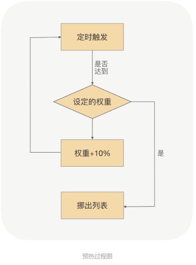

**延迟暴露**

服务启动，有可能还没加载完就把RPC的bean服务注册到注册中心了。因此我们可以先让应用启动完成，预留一个Hook过程，让用户扩展实现模拟调用（让JVM指令能够预热起来），之后在发布到注册中心。

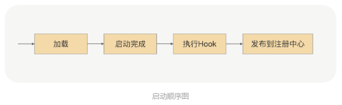

## 熔断限流

- 服务端通过限流进行自我保护，服务端的限流阈值配置都是作用于单机的，如果需要对整个服务设置限流阈值，可以在注册中心或者配置中心下发限流阈值，让RPC框架自己去计算，也可以依赖一个专门的限流服务，但是性能和耗时上有劣势。还有可以通过降级等方案。
- 调用端可以通过熔断机制进行自我保护，防止调用下游服务出现异常，或者耗时过长影响调用端的业务逻辑，RPC框架可以在动态代理的逻辑上去整合熔断器，实现RPC的熔断功能。

## 业务分组

熔断限流对业务还是有损的，通过流量隔离可以最大限度保障业务无损。如下图

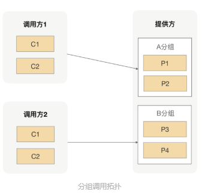

分组带来一个直接问题是影响高可用，可以通过“借道”方式配置次分组。

# 高级

## 异步RPC

异步调用可以压榨单机吞吐量，因为向服务端发送请求与接收服务端发送过来的响应消息是完全独立的，可以让RPC框架提供一种回调方式，让业务逻辑异步处理，处理完之后调用RPC框架的回调接口，将最终的结果通过回调方式响应给调用端。

实现方案可以使用Java8原生支持的ComplableFuture

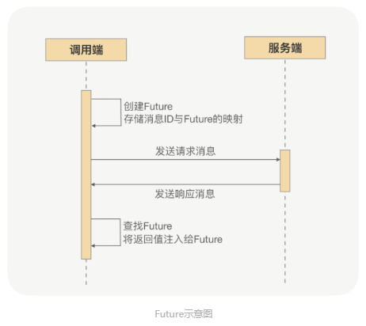

## 安全问题

服务提供方将jar发布到私服上，所有的应用都可以通过这个jar坐标调用，带来一定的隐患。

HMAC（不可逆加密算法）是一种实现，服务提供方应用里放一个用于HMAC签名的私钥，在授权平台上用这个私钥为申请调用的调用方应用进行签名，这个签名生成的串就变成了调用方唯一的身份。服务提供方在收到调用方的授权请求之后，只需要验证下这个签名跟调用方应用信息是否一致即可。

## 问题定位

**借助合理的分装异常信息**

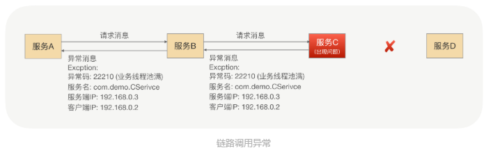

**借助分布式链路跟踪**

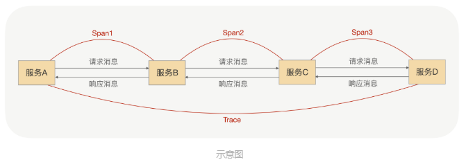

## 时钟轮

假设调用端1s内发送了1万次请求，这1万次请求都是5s后超时，这是扫描的线程在这5s内会不停的重复扫描，很浪费CPU资源，这是可以采用时钟轮，将请求超时的定时任务放到时钟轮的槽当中。

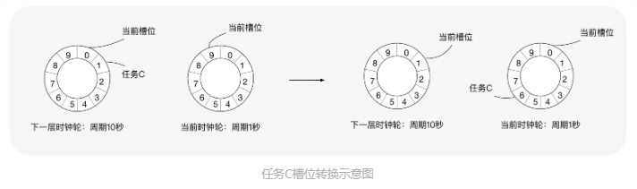

**注意点**：

1. 时钟槽位的单位越短，时间轮触发任务的时间就越精确；
2. 时钟轮的槽位越多，那么一个任务被重复扫描的概率越小，因为只有在多重时钟轮中的任务才会被重复扫描。

**使用场景**：调用端超时处理；调用端与服务端启动超时；定时心跳

## 流量回放

新应用改造后重新测试的成本高，结果也不一定可靠。已知线上流量比手动维护的TestCase的场景更加丰富，可以记录线上的请求和返回，对新改造的应用进行“流量回放”，即用对应的请求去调用，再与预期结果对比。

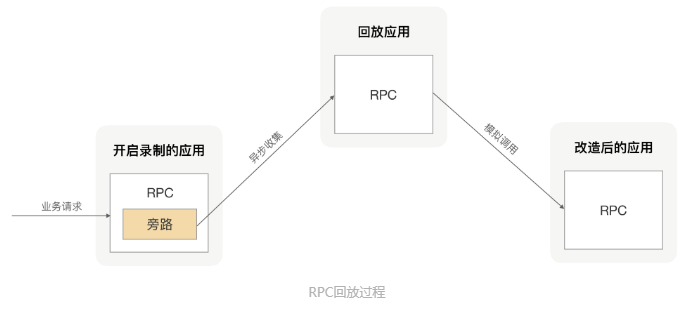

## 泛化调用

有时候调用方并不知道服务提供方的接口API，如

**场景一**

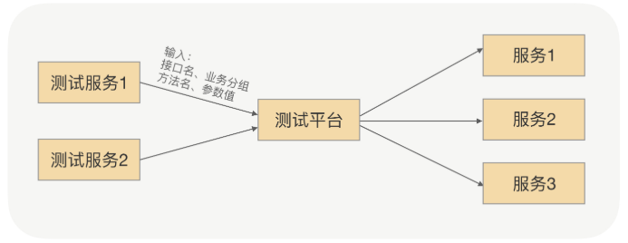

**场景二**

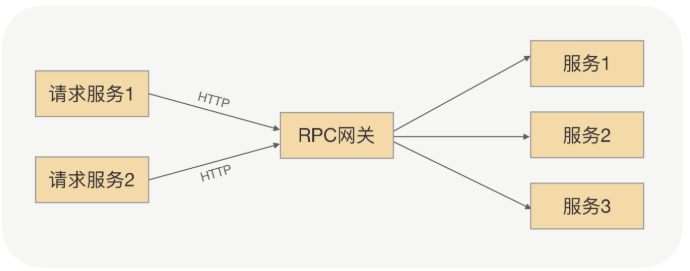

这时，可以采用泛化调用方式

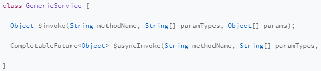

